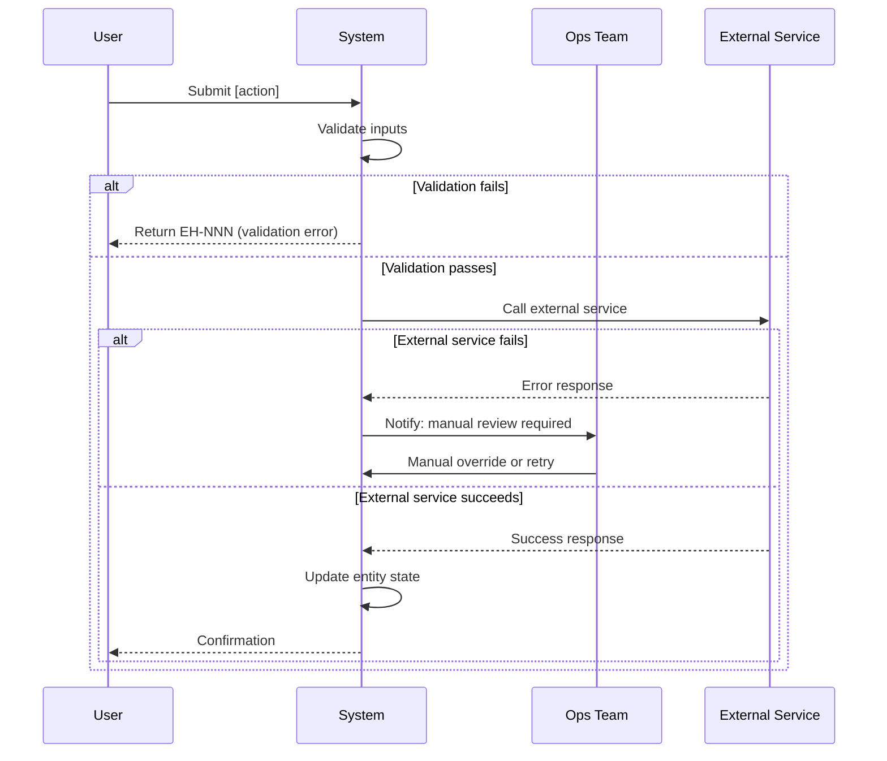

# Business Process Workflow

Map the operational processes that run behind user-facing journeys. This phase captures what humans and systems do to make the product work — approvals, fulfillment, exception handling, compliance steps, escalation paths, and scheduled operations. These processes reveal data entities and state machines the data model must support.

---

## Step 0: Workspace Resolution
Run this bash to determine workspace paths:
```bash
BRANCH=$(git branch --show-current 2>/dev/null || echo "default")
BRANCH=$(echo "$BRANCH" | tr '[:upper:]' '[:lower:]' | sed 's|/|--|g' | sed 's|[^a-z0-9-]|-|g' | sed 's|-\+|-|g' | sed 's|^-||;s|-$||')
[ -z "$BRANCH" ] && BRANCH="default"
WORKSPACE=".claude/ai-sdlc/workflows/$BRANCH"
STATE="$WORKSPACE/state.json"
ARTIFACTS="$WORKSPACE/artifacts"
mkdir -p "$WORKSPACE/artifacts"
```
Then use $WORKSPACE, $STATE, $ARTIFACTS throughout.

## Step 1: Pre-Flight

Read in parallel:
- `$ARTIFACTS/journey/customer-journey.md` — required; business processes derive from journey touchpoints
- `$ARTIFACTS/idea/prd.md` — for requirements context and business rules
- `$ARTIFACTS/personas/personas.md` — to understand operational roles
- `$ARTIFACTS/business-process/business-process.md` — existing document (if any — update, never recreate)
- `$STATE` — project context (read and parse JSON)

If customer-journey.md does not exist: STOP. Inform the user that customer journeys must be mapped first. Suggest `/sdlc:04-customer-journey`.

---

## Step 2: Process Discovery

Scan CUSTOMER_JOURNEY.md and PRODUCT_SPEC.md to identify all business processes. A process exists anywhere that:
- A user action triggers a back-office workflow (approval, fulfillment, review)
- A state change requires human intervention or multiple system steps
- An SLA or deadline must be tracked
- A compliance or audit step is required
- A scheduled or batch operation runs
- An exception or dispute must be managed
- An external party (supplier, partner, regulator) is involved

**Build the process inventory:**

| BP-ID | Process Name | Type | Trigger | Primary Actor | SLA |
|-------|-------------|------|---------|---------------|-----|
| BP-001 | [Name] | Automated \| Human-in-loop \| Manual | [Journey step or system event] | [Role/System] | [Duration] |

**Process types:**
- **Automated** — system executes without human action
- **Human-in-loop** — system handles most steps, human acts at decision points
- **Manual** — primarily human-driven, system provides tools/tracking

**Assign BP-IDs sequentially.** IDs are immutable — only deprecated, never deleted or renumbered.

**Deprecation format:**
```
~~BP-005~~: *Deprecated [date] — replaced by BP-012 (consolidated with approval flow)*
```

---

## Step 3: Map Each Process

For each BP-ID in the inventory, document the full process:

### Process Header

```markdown
## BP-NNN: [Process Name]
*Last Updated: [date]*

**Type:** Automated | Human-in-loop | Manual
**Trigger:** [Exact event — e.g., "User submits order", "Nightly batch job at 02:00 UTC", "Support ticket escalated to Tier 2"]
**Outcome:** [What success looks like — the observable end state]
**Process Owner:** [Role responsible for this process working correctly]
**SLA:** [Total allowed duration — e.g., "< 2 business hours", "< 24 hours", "Real-time"]
**Linked Journey:** [CUSTOMER_JOURNEY.md journey name(s) that trigger this]
**Linked Requirements:** [REQ-IDs and BR-IDs from PRODUCT_SPEC.md]
```

### Participants

List every actor in the process:

| Actor | Type | Role in Process |
|-------|------|----------------|
| [Name] | User \| Internal System \| Human Operator \| External System \| External Party | [What they do] |

### Swimlane Sequence Diagram

Use Mermaid sequence diagrams for all processes. Show the flow between actors including branching and failure paths:

```markdown

```

For simple processes (≤ 5 steps, no branching): a numbered step list is acceptable instead of a diagram.

### RACI

For each step, document who is Responsible, Accountable, Consulted, and Informed:

| Step | Responsible | Accountable | Consulted | Informed |
|------|-------------|-------------|-----------|---------|
| 1. [Step name] | [Role] | [Role] | [Role] | [Role] |

- **Responsible** — does the work
- **Accountable** — owns the outcome (one person/role only)
- **Consulted** — input required before acting
- **Informed** — notified after acting

### SLA Breakdown

| Step | Max Duration | If Breached |
|------|-------------|-------------|
| [Step 1] | [e.g., 30 seconds] | [e.g., Auto-escalate to ops] |
| [Step 2 — human] | [e.g., 4 business hours] | [e.g., Notify manager, flag in dashboard] |
| **Total** | **[Total SLA]** | **[Overall breach action]** |

### Exception Paths

For each failure mode in this process:

| Exception | Trigger | Handling | Escalation | Recovery |
|-----------|---------|----------|------------|----------|
| [What can go wrong] | [When it occurs] | [Immediate action] | [Who is notified] | [How normal flow resumes] |

Every exception path must state:
- Who gets notified
- Whether the process can self-heal or requires human intervention
- How the actor who triggered the process is informed

### Data Requirements

List every entity this process reads, creates, or mutates:

| Entity | Operation | Fields Affected | Notes |
|--------|-----------|-----------------|-------|
| [EntityName] | Read \| Create \| Update \| Delete | [Field names] | [e.g., "state changes from PENDING to APPROVED"] |

**Data model implications** — flag any of the following for Phase 5:
- New entities needed (operational records, audit logs, assignment records)
- New state machine fields on existing entities (status, assigned_to, escalated_at)
- New timing fields (sla_deadline, started_at, completed_at)
- New relationship requirements (e.g., an approval record belongs to an order)

```markdown
### ⚠️ Data Model Flags (for Phase 5)
- [ ] New entity needed: `ApprovalRecord` (stores decision, actor, timestamp per approval step)
- [ ] New field on `Order`: `status` (state machine: PENDING → APPROVED → FULFILLED → CANCELLED)
- [ ] New field on `Order`: `sla_deadline` (computed from trigger timestamp + SLA)
```

### Integration Points

| System/Service | Direction | What's Exchanged | Failure Handling |
|---------------|-----------|-----------------|-----------------|
| [Service name] | Inbound \| Outbound \| Both | [Event, message, API call] | [What happens if unavailable] |

---

## Step 4: Cross-Reference Check

Before writing the output document, verify:

1. **Journey coverage:** every process mentioned in CUSTOMER_JOURNEY.md `## Business Processes` section has a BP-ID in this document
2. **Requirements coverage:** every BR-ID that implies a process (approval, validation, audit) is linked to a BP-ID
3. **Exception completeness:** every process with a human-in-loop step has a defined SLA breach action
4. **Data flag completeness:** every new entity or state machine implied by a process is flagged for Phase 5

If gaps are found: document them as `⚠️ UNRESOLVED` items at the top of the output document.

---

## Step 5: Write Output Document

**Update or create `$ARTIFACTS/business-process/business-process.md`:**

```markdown
# Business Processes
*Last Updated: [ISO date]*

## TL;DR
[2-3 sentences: how many processes, primary types, key actors, key data model implications]

## Contents
- [Process Inventory](#process-inventory)
- [BP-001: Name](#bp-001-name)
- ...
- [Data Model Implications Summary](#data-model-implications-summary)
- [Open Items](#open-items)

---

## Process Inventory

| BP-ID | Process Name | Type | Trigger | Owner | SLA |
|-------|-------------|------|---------|-------|-----|
| BP-001 | ... | ... | ... | ... | ... |

---

## [Individual process sections — one per BP-ID]

---

## Data Model Implications Summary

Consolidated list of all ⚠️ flags from individual process sections. This is the input consumed by `/sdlc:05-data-model`.

| Entity/Field | Change | Required By |
|-------------|--------|------------|
| [Entity] | New entity | BP-NNN |
| [Entity.field] | New field | BP-NNN |

---

## Open Items

| # | Item | Owner | Due |
|---|------|-------|-----|
| 1 | [Unresolved process or gap] | [Role] | [Phase/Date] |
```

---

## Step 6: Update State

Mark Phase 4b complete in $STATE. Add to document index:
- `$ARTIFACTS/business-process/business-process.md`

---

## Step 7: Output Summary

```
✅ Business Processes Complete

Processes mapped: [N]
  Automated:       [N]
  Human-in-loop:   [N]
  Manual:          [N]

Data model flags:  [N] new entities / fields needed for Phase 5
Open items:        [N]

File: $ARTIFACTS/business-process/business-process.md

Recommended Next: /sdlc:05-data-model ⚠️ (Critical Gate)
  → Read business-process.md ## Data Model Implications Summary before modelling
```
