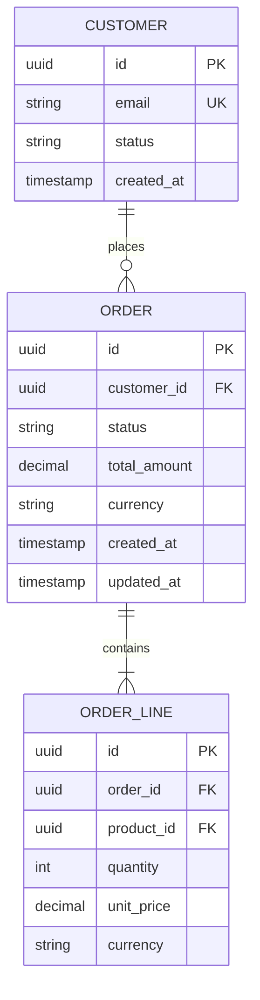

# Data Model Workflow

The canonical data model is the FOUNDATION. Everything downstream — architecture, APIs, code, tests — derives from it. Treat this as the most critical artifact in the system.

## Step 0: Workspace Resolution
Run this bash to determine workspace paths:
```bash
BRANCH=$(git branch --show-current 2>/dev/null || echo "default")
BRANCH=$(echo "$BRANCH" | tr '[:upper:]' '[:lower:]' | sed 's|/|--|g' | sed 's|[^a-z0-9-]|-|g' | sed 's|-\+|-|g' | sed 's|^-||;s|-$||')
[ -z "$BRANCH" ] && BRANCH="default"
WORKSPACE=".claude/ai-sdlc/workflows/$BRANCH"
STATE="$WORKSPACE/state.json"
ARTIFACTS="$WORKSPACE/artifacts"
mkdir -p "$WORKSPACE/artifacts"
```
Then use $WORKSPACE, $STATE, $ARTIFACTS throughout.

## Step 1: Pre-Flight Gate Check

Read in parallel:
- `$ARTIFACTS/idea/prd.md` — required, must exist
- `$ARTIFACTS/data-model/data-model.md` — existing model (if any)
- `$ARTIFACTS/data-model/data-dictionary.md` — existing dictionary (if any)
- `$ARTIFACTS/research/synthesis.md` — for context (if exists)
- `$ARTIFACTS/business-process/business-process.md` — if exists, read `## Data Model Implications Summary` section; these flags are direct inputs to this phase
- `$STATE` — project context (read and parse JSON)

If business-process.md exists: before domain analysis, review its `## Data Model Implications Summary` table. Every flagged entity/field must be addressed during modelling — either incorporated or explicitly decided against with a reason recorded.

If prd.md does not exist: STOP. Inform the user that the product spec must be defined first. Suggest `/sdlc:03-product-spec`.

If data-model.md already exists and $ARGUMENTS mentions changes to existing entities:
→ Automatically activate `--review` mode. Changes to existing entities ALWAYS require review.

## Step 2: Domain Analysis

Perform Domain-Driven Design analysis:

**Identify Bounded Contexts:**
- What are the distinct business domains in this system?
- Where are the natural seams? (different teams, different change rates, different vocabularies)
- Document each bounded context with its purpose and owner

**Identify Aggregates:**
Within each bounded context:
- What is the consistency boundary? (what must change together)
- What is the aggregate root? (the entry point for all operations on the cluster)
- What are the invariants? (business rules that must always hold true)

**Identify Entities:**
- What has a unique identity that persists over time?
- What is its lifecycle? (states it passes through)
- What are its mandatory vs optional attributes?

**Identify Value Objects:**
- What is defined only by its attributes (no identity)?
- What is immutable once created?
- Examples: Money(amount, currency), Address, DateRange, Email

**Identify Domain Events:**
- What significant things happen in this domain?
- What do downstream systems care about?
- Format: [EntityName][PastTenseVerb] (e.g., OrderPlaced, PaymentProcessed)

## Step 3: Check Industry Standards

For the domain being modeled, check relevant standards:

```
DOMAIN          → STANDARDS TO CHECK
Payments        → ISO 20022, PCI-DSS data requirements, SWIFT
Identity/Auth   → OpenID Connect, OAuth 2.0, SCIM
Healthcare      → FHIR R4, HL7, ICD-10
E-commerce      → GS1, product catalogs, pricing standards
Financial       → XBRL, IFRS data model, Basel reporting
Geolocation     → GeoJSON, WGS84, ISO 3166 country codes
Time/Calendar   → ISO 8601, timezone handling (IANA tz database)
Addresses       → ISO 3166, USPS/Royal Mail format standards
Currency        → ISO 4217 (3-letter codes)
Language/Locale → BCP 47, ISO 639
Documents       → Dublin Core metadata, PDF/A standards
```

Search for standards if the domain is specialized: "[domain] data model standard"
Apply relevant standards to field types, naming, and constraints.

## Step 4: Design the Data Model

For each entity, define:

**Entity definition:**
```
Entity: [Name]
Bounded Context: [context]
Aggregate Root: [yes/no — if yes, what it contains]
Description: [business meaning, 1-2 sentences]

Attributes:
  id          UUID        PK, immutable, system-generated
  [field]     [type]      [nullable?] [unique?] [description] [standard ref if any]
  created_at  timestamp   system-generated, immutable
  updated_at  timestamp   system-updated
  version     integer     optimistic locking (if needed)
  deleted_at  timestamp   nullable, soft delete marker (null = active)

  # Data Classification (PII/Security):
  # For each sensitive field, add a comment:
  # [field]  [type]  [nullable]  [PII: yes/no]  [Encrypted at rest: yes/no]  [Masked in logs: yes/no]

Invariants:
  - [business rule that must always hold]
  - [another invariant]

Lifecycle States: [DRAFT → ACTIVE → SUSPENDED → ARCHIVED] (if stateful)

Relationships:
  - has-many [Entity] via [field] (CASCADE | RESTRICT)
  - belongs-to [Entity] via [foreign_key]
  - many-to-many [Entity] via [join_entity]
```

**Relationship rules:**
- Use UUIDs for all primary keys (not auto-increment integers in distributed systems)
- Always include created_at, updated_at on all entities
- Soft deletes (deleted_at) for auditable entities
- Optimistic locking (version) for entities with concurrent update risk
- Foreign keys always nullable if the relationship is optional
- Junction/join tables are full entities (with their own IDs and timestamps)

**After each entity definition, include a Data Security Classification block:**

```
Data Security Classification:
  PII fields: [list fields containing personally identifiable information]
  PHI fields: [list fields containing protected health information — HIPAA]
  PCI fields: [list fields containing payment card data — PCI-DSS]
  Encrypted at rest: [list fields requiring encryption]
  Log masking required: [list fields that must NEVER appear in logs]
  Retention period: [how long this entity's records are kept]
  Deletion trigger: [what causes this record to be deleted/archived]
```

## Step 4.5: Multi-Tenancy Modeling (if applicable)

If `projectAssumptions.multiTenant == "yes"` (check $STATE):

Every entity that belongs to a tenant MUST have:
```
  tenant_id   UUID   NOT NULL FK → tenants.id   (enforce at DB level)
```

Rules:
- All queries MUST filter by tenant_id (never query cross-tenant)
- tenant_id must be part of composite indexes on frequently-queried entities
- API layer must inject tenant_id from the authenticated user's JWT — callers never supply their own
- Cross-tenant data (shared reference data) lives in a separate bounded context with no tenant_id
- Document every entity as: TENANT-SCOPED or SHARED

If `projectAssumptions.multiTenant` is not "yes", skip this step entirely.

## Step 5: Impact Analysis (if modifying existing model)

For any change to existing entities:

**Breaking changes (require explicit user confirmation):**
- Removing a field
- Changing a field's type
- Adding a NOT NULL constraint to existing field
- Renaming an entity or field
- Changing relationship cardinality

**Non-breaking changes (proceed with note):**
- Adding new optional fields
- Adding new entities
- Adding new relationships with nullable FK
- Adding new indexes
- Adding new lifecycle states (append-only)

Show impact matrix:
```
CHANGE              | IMPACT ON                  | BREAKING?
[field removed]     | API_SPEC.md section X      | YES
[field removed]     | TEST_CASES.md TC-012       | YES
[field removed]     | Code: UserService.getUser  | YES
```

Get user confirmation before applying breaking changes.

## Step 6: Build ERD Diagrams

Create Mermaid ER diagrams for each bounded context:



Create a high-level context diagram showing bounded context boundaries.

## Step 7: Write Output Documents

**Update $ARTIFACTS/data-model/data-model.md:**

```markdown
# Canonical Data Model
*Last Updated: [date] | Version: [semver]*
*⚠️ FOUNDATION: All architecture, APIs, and code derive from this document.*

## Change History
| Version | Date | Author | Change | Breaking? |
|---|---|---|---|---|
| 1.0.0 | [date] | [via /sdlc] | Initial model | - |

## Bounded Contexts
[List with descriptions]

## [Context Name] Context

### Aggregates
[ERD diagram]
[Entity definitions]

## Cross-Context References
[How contexts reference each other (by ID only, never by embedding)]

## Domain Events
[Event catalog]

## Invariants Summary
[Cross-entity business rules]
```

**Update $ARTIFACTS/data-model/data-dictionary.md:**

Every field in the system:
```markdown
# Data Dictionary
*Last Updated: [date]*

## [EntityName]

| Field | Type | Nullable | Unique | Constraints | Business Meaning | Standard Ref |
|---|---|---|---|---|---|---|
| id | UUID | No | Yes (PK) | Immutable | System identifier | RFC 4122 |
| email | VARCHAR(254) | No | Yes | RFC 5321 format | User email address | RFC 5321 |
```

## Step 7.5: Challenger Review

Before writing is finalised, take an adversarial stance against the model just designed. Assume the role of a senior DDD engineer who is actively trying to find fatal flaws — not someone looking to validate the work.

Re-read `data-model.md` and `data-dictionary.md` and answer each challenge below. For each issue found, assign a severity (BLOCKING / WARN) and a recommended fix.

**Challenge 1 — Missing entities**
Read every feature in `prd.md`. For each one, ask: does the data model have everything needed to implement this? Common gaps:
- Audit/history tables implied by "change log" or "activity feed" requirements
- Join entities implied by many-to-many relationships described in prose
- Reference data tables (status codes, categories, types) that are used as enums in prose but need to be queryable
- Configuration or settings entities that appear in NFRs or business rules but aren't modelled

**Challenge 2 — Aggregate boundaries**
For each aggregate, challenge whether the boundary is correctly drawn:
- Is anything in this aggregate that changes at a different rate than the root? (should be extracted)
- Does loading this aggregate require joining more than 3 tables? (boundary may be too large)
- Is there any use case that modifies two aggregates in one transaction? (boundary may be wrong, or a saga is needed)
- Are there child entities that are accessed independently of the root? (they may need their own aggregate)

**Challenge 3 — Missing invariants**
For each entity, read its business rules in `prd.md`. Ask: are all rules that must *always* be true encoded as invariants?
- State machine transitions: is every valid state and every valid transition explicit?
- Mandatory relationships: if an entity cannot exist without a related entity, is that enforced?
- Cross-field rules: if field A constrains field B, is that invariant documented?
- Numeric constraints: minimums, maximums, precision requirements

**Challenge 4 — Primitive obsession**
Look for fields that are raw strings or numbers but carry domain meaning:
- Currency amounts without a paired currency code (should be Money value object)
- Phone numbers, email addresses, URLs stored as plain VARCHAR (should be typed value objects with validation)
- Status fields as raw strings instead of an enum/lifecycle state machine
- Any field described with "format: X" in the PRD that is stored as a plain type

**Challenge 5 — Wrong cardinality**
For each relationship, verify the cardinality by tracing a concrete example:
- "A customer can have many orders" — is there any business scenario where an order belongs to more than one customer? (if so, cardinality is wrong)
- One-to-one relationships: is this truly always 1:1, or is it 1:1 *today* and likely to become 1:many?
- Optional vs required: can an order exist without a customer? If not, the FK must be NOT NULL

**Challenge 6 — Naming and ubiquitous language**
Compare entity and field names against the language used in `prd.md` and the team's domain vocabulary:
- Does any entity name differ from what the business calls it? (confusion at the seam between model and business)
- Are there synonyms for the same concept in different entities? (naming drift signals a missing abstraction)
- Are any names generic enough to be confused? (`data`, `info`, `record`, `item` are red flags)

---

**Present findings:**

```
Data Model Challenger Review
════════════════════════════════════════
[For each issue found:]

[BLOCKING | WARN]  [challenge area] — [entity/field name]
  [1-2 sentence description of the problem]
  Recommended fix: [specific change]

[If no issues found:]
✅  No significant issues found across all 6 challenge areas.
    The model appears complete and correctly bounded for the stated requirements.

→ Review these findings before proceeding to the review gate.
  Address BLOCKING items now. WARN items can proceed with a noted decision.
```

If the user wants to fix a BLOCKING item: update the model, re-run this step, then continue.
If proceeding past a WARN: record the decision in `$STATE` decisions array.

---

## Step 8: Review Gate

Before finalizing, run self-review:
- [ ] Every entity has id, created_at, updated_at
- [ ] Every relationship has explicit cardinality
- [ ] Every invariant is documented
- [ ] No circular dependencies between aggregates
- [ ] All domain events are catalogued
- [ ] Breaking changes confirmed by user
- [ ] Industry standards applied where relevant
- [ ] DATA_DICTIONARY.md complete for all new/changed fields
- [ ] PII fields identified and classified for all entities
- [ ] Encryption-at-rest fields documented
- [ ] Log masking fields documented
- [ ] Data retention periods set for all entities
- [ ] Soft-delete (deleted_at) on all user-visible entities
- [ ] Audit trail fields (created_by, updated_by) on entities requiring change tracking
- [ ] Multi-tenancy: tenant_id on all tenant-scoped entities (if multiTenant=yes from projectAssumptions)

## Step 9: Update State

Update `$STATE`:
- Mark Phase 5 (Data Model) as complete
- Add model version to decisions: `{"date": "[date]", "type": "DATA-MODEL", "note": "v[version]: [key design decision]"}`
- Note any breaking changes made

Show user:
```
✅ Data Model Complete (v[version])

Bounded Contexts: [N]
Entities: [N] ([N] new, [N] updated)
Breaking Changes: [N] (confirmed)

Files Updated:
• $ARTIFACTS/data-model/data-model.md
• $ARTIFACTS/data-model/data-dictionary.md

⚠️  GATE UNLOCKED: Tech Architecture and Code phases can now proceed.
Recommended Next: /sdlc:verify --phase 5   ← run this before proceeding
Then:           /sdlc:06-tech-arch
```
