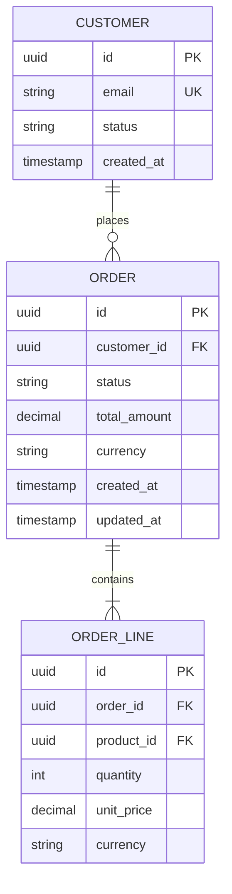

# Data Model Workflow

The canonical data model is the FOUNDATION. Everything downstream — architecture, APIs, code, tests — derives from it. Treat this as the most critical artifact in the system.

## Step 1: Pre-Flight Gate Check

Read in parallel:
- `docs/product/PRODUCT_SPEC.md` — required, must exist
- `docs/data/DATA_MODEL.md` — existing model (if any)
- `docs/data/DATA_DICTIONARY.md` — existing dictionary (if any)
- `docs/research/SYNTHESIS.md` — for context (if exists)
- `docs/product/BUSINESS_PROCESS.md` — if exists, read `## Data Model Implications Summary` section; these flags are direct inputs to this phase
- `.sdlc/STATE.md` — project context

If BUSINESS_PROCESS.md exists: before domain analysis, review its `## Data Model Implications Summary` table. Every flagged entity/field must be addressed during modelling — either incorporated or explicitly decided against with a reason recorded.

If PRODUCT_SPEC.md does not exist: STOP. Inform the user that the product spec must be defined first. Suggest `/sdlc:03-product-spec`.

If DATA_MODEL.md already exists and $ARGUMENTS mentions changes to existing entities:
→ Automatically activate `--review` mode. Changes to existing entities ALWAYS require review.

## Step 2: Domain Analysis

Perform Domain-Driven Design analysis:

**Identify Bounded Contexts:**
- What are the distinct business domains in this system?
- Where are the natural seams? (different teams, different change rates, different vocabularies)
- Document each bounded context with its purpose and owner

**Identify Aggregates:**
Within each bounded context:
- What is the consistency boundary? (what must change together)
- What is the aggregate root? (the entry point for all operations on the cluster)
- What are the invariants? (business rules that must always hold true)

**Identify Entities:**
- What has a unique identity that persists over time?
- What is its lifecycle? (states it passes through)
- What are its mandatory vs optional attributes?

**Identify Value Objects:**
- What is defined only by its attributes (no identity)?
- What is immutable once created?
- Examples: Money(amount, currency), Address, DateRange, Email

**Identify Domain Events:**
- What significant things happen in this domain?
- What do downstream systems care about?
- Format: [EntityName][PastTenseVerb] (e.g., OrderPlaced, PaymentProcessed)

## Step 3: Check Industry Standards

For the domain being modeled, check relevant standards:

```
DOMAIN          → STANDARDS TO CHECK
Payments        → ISO 20022, PCI-DSS data requirements, SWIFT
Identity/Auth   → OpenID Connect, OAuth 2.0, SCIM
Healthcare      → FHIR R4, HL7, ICD-10
E-commerce      → GS1, product catalogs, pricing standards
Financial       → XBRL, IFRS data model, Basel reporting
Geolocation     → GeoJSON, WGS84, ISO 3166 country codes
Time/Calendar   → ISO 8601, timezone handling (IANA tz database)
Addresses       → ISO 3166, USPS/Royal Mail format standards
Currency        → ISO 4217 (3-letter codes)
Language/Locale → BCP 47, ISO 639
Documents       → Dublin Core metadata, PDF/A standards
```

Search for standards if the domain is specialized: "[domain] data model standard"
Apply relevant standards to field types, naming, and constraints.

## Step 4: Design the Data Model

For each entity, define:

**Entity definition:**
```
Entity: [Name]
Bounded Context: [context]
Aggregate Root: [yes/no — if yes, what it contains]
Description: [business meaning, 1-2 sentences]

Attributes:
  id          UUID        PK, immutable, system-generated
  [field]     [type]      [nullable?] [unique?] [description] [standard ref if any]
  created_at  timestamp   system-generated, immutable
  updated_at  timestamp   system-updated
  version     integer     optimistic locking (if needed)

Invariants:
  - [business rule that must always hold]
  - [another invariant]

Lifecycle States: [DRAFT → ACTIVE → SUSPENDED → ARCHIVED] (if stateful)

Relationships:
  - has-many [Entity] via [field] (CASCADE | RESTRICT)
  - belongs-to [Entity] via [foreign_key]
  - many-to-many [Entity] via [join_entity]
```

**Relationship rules:**
- Use UUIDs for all primary keys (not auto-increment integers in distributed systems)
- Always include created_at, updated_at on all entities
- Soft deletes (deleted_at) for auditable entities
- Optimistic locking (version) for entities with concurrent update risk
- Foreign keys always nullable if the relationship is optional
- Junction/join tables are full entities (with their own IDs and timestamps)

## Step 5: Impact Analysis (if modifying existing model)

For any change to existing entities:

**Breaking changes (require explicit user confirmation):**
- Removing a field
- Changing a field's type
- Adding a NOT NULL constraint to existing field
- Renaming an entity or field
- Changing relationship cardinality

**Non-breaking changes (proceed with note):**
- Adding new optional fields
- Adding new entities
- Adding new relationships with nullable FK
- Adding new indexes
- Adding new lifecycle states (append-only)

Show impact matrix:
```
CHANGE              | IMPACT ON                  | BREAKING?
[field removed]     | API_SPEC.md section X      | YES
[field removed]     | TEST_CASES.md TC-012       | YES
[field removed]     | Code: UserService.getUser  | YES
```

Get user confirmation before applying breaking changes.

## Step 6: Build ERD Diagrams

Create Mermaid ER diagrams for each bounded context:



Create a high-level context diagram showing bounded context boundaries.

## Step 7: Write Output Documents

**Update docs/data/DATA_MODEL.md:**

```markdown
# Canonical Data Model
*Last Updated: [date] | Version: [semver]*
*⚠️ FOUNDATION: All architecture, APIs, and code derive from this document.*

## Change History
| Version | Date | Author | Change | Breaking? |
|---|---|---|---|---|
| 1.0.0 | [date] | [via /sdlc] | Initial model | - |

## Bounded Contexts
[List with descriptions]

## [Context Name] Context

### Aggregates
[ERD diagram]
[Entity definitions]

## Cross-Context References
[How contexts reference each other (by ID only, never by embedding)]

## Domain Events
[Event catalog]

## Invariants Summary
[Cross-entity business rules]
```

**Update docs/data/DATA_DICTIONARY.md:**

Every field in the system:
```markdown
# Data Dictionary
*Last Updated: [date]*

## [EntityName]

| Field | Type | Nullable | Unique | Constraints | Business Meaning | Standard Ref |
|---|---|---|---|---|---|---|
| id | UUID | No | Yes (PK) | Immutable | System identifier | RFC 4122 |
| email | VARCHAR(254) | No | Yes | RFC 5321 format | User email address | RFC 5321 |
```

## Step 8: Review Gate

Before finalizing, run self-review:
- [ ] Every entity has id, created_at, updated_at
- [ ] Every relationship has explicit cardinality
- [ ] Every invariant is documented
- [ ] No circular dependencies between aggregates
- [ ] All domain events are catalogued
- [ ] Breaking changes confirmed by user
- [ ] Industry standards applied where relevant
- [ ] DATA_DICTIONARY.md complete for all new/changed fields

## Step 9: Update State

Update `.sdlc/STATE.md`:
- Mark Phase 5 (Data Model) as complete
- Add model version to Decisions: `[date] DATA-MODEL v[version]: [key design decision]`
- Note any breaking changes made

Show user:
```
✅ Data Model Complete (v[version])

Bounded Contexts: [N]
Entities: [N] ([N] new, [N] updated)
Breaking Changes: [N] (confirmed)

Files Updated:
• docs/data/DATA_MODEL.md
• docs/data/DATA_DICTIONARY.md

⚠️  GATE UNLOCKED: Tech Architecture and Code phases can now proceed.
Recommended Next: /sdlc:verify --phase 5   ← run this before proceeding
Then:           /sdlc:06-tech-arch
```
