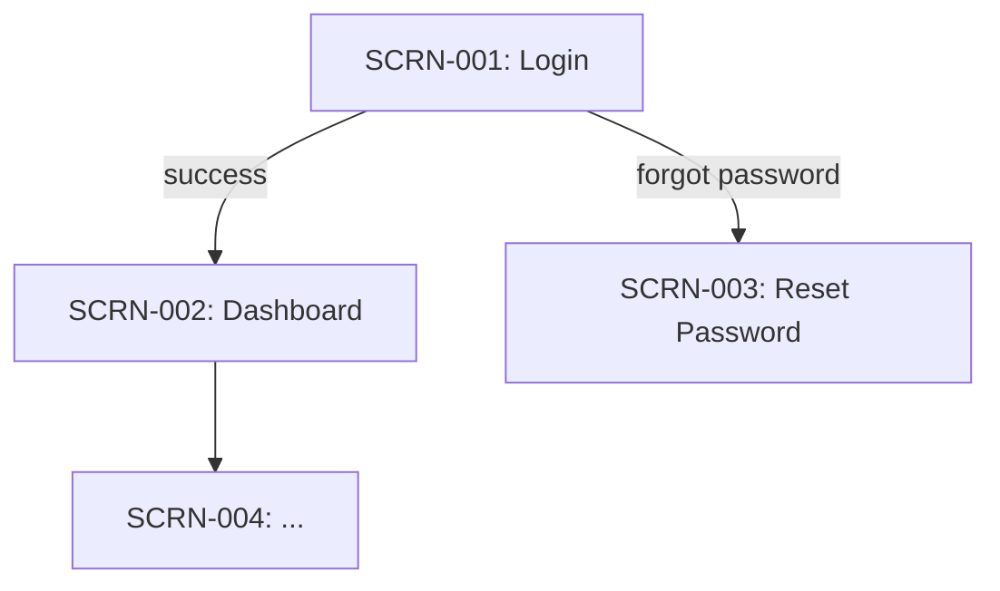

# Prototype Workflow

Phase 4c low-fidelity prototyping. Validate the interaction model before the data model is designed. ASCII-style wireframes for every screen ensure the UX is sound before schema decisions lock in.

---

## Step 0: Workspace Resolution

```bash
BRANCH=$(git branch --show-current 2>/dev/null || echo "default")
BRANCH=$(echo "$BRANCH" | tr '[:upper:]' '[:lower:]' | sed 's|/|--|g' | sed 's|[^a-z0-9-]|-|g' | sed 's|-\+|-|g' | sed 's|^-||;s|-$||')
[ -z "$BRANCH" ] && BRANCH="default"
WORKSPACE=".claude/ai-sdlc/workflows/$BRANCH"
STATE="$WORKSPACE/state.json"
ARTIFACTS="$WORKSPACE/artifacts"
mkdir -p "$ARTIFACTS"
```

Then use `$WORKSPACE`, `$STATE`, `$ARTIFACTS` throughout.

---

## Step 1: Gate Check

**HARD gate:** `$ARTIFACTS/idea/prd.md` must exist. If missing: STOP. Tell the user to complete the idea phase first (the product spec phase or the product spec phase).

**Soft check:** `$ARTIFACTS/journey/customer-journey.md` is preferred. If missing: warn the user that journey mapping enriches the screen inventory, recommend running the customer journey phase first, but allow continuation.

Read in parallel:
- `$ARTIFACTS/idea/prd.md` — user flows, acceptance criteria, feature description
- `$ARTIFACTS/journey/customer-journey.md` — journey steps and touchpoints (if exists)

**Execution mode:** INTERACTIVE — present the screen inventory for confirmation before producing wireframes.

---

## Step 2: Identify All Screens

Read prd.md and customer-journey.md (if available). Extract every interaction that requires a distinct screen or modal.

A screen exists wherever:
- A user must view information to make a decision
- A user must perform an action (form, tap, selection)
- A system state is displayed (loading, empty, error, success)
- Navigation or wayfinding is required

Build the **Screen Inventory** table:

| SCRN-ID | Screen Name | Entry Points | Purpose | Notes |
|---------|-------------|-------------|---------|-------|
| SCRN-001 | [name] | [what leads here] | [one-line purpose] | [flags or questions] |

Assign SCRN-IDs sequentially. Every screen must have an ID.

If scoping by `$ARGUMENTS` (a specific feature or screen name): filter to screens relevant to that scope only. Document excluded screens as "out of scope for this run."

---

## Step 3: Define Each Screen

For every SCRN-ID, define the full specification:

```
SCRN-NNN: [Screen Name]
Purpose:      [one sentence — what the user accomplishes here]
Entry points: [list of screens/events that lead here]
Primary content/actions (max 5):
  1. [element name] — [type: display | input | action | navigation]
  2. [element name] — [type]
  3. [element name] — [type]
Success state:   [what the screen shows when things work]
Error state(s):  [what the screen shows on each failure mode]
Navigation:      [where the user can go from here]
```

---

## Step 4: Produce ASCII Wireframes

For each screen, produce a markdown text-art wireframe. Use only characters available in standard markdown code blocks.

Guidelines:
- Use `+`, `-`, `|` for borders and boxes
- Use `[ Button ]` for actions
- Use `[_________]` for text inputs
- Use `(o)` for selected radio, `( )` for unselected
- Use `[x]` for checked checkbox, `[ ]` for unchecked
- Use `▼` for dropdowns
- Use `░░░░░░░░` for image/media placeholders
- Label every element clearly
- Show both the default state and the primary error/empty state in separate wireframes

Example format:

```
SCRN-001: Login Screen
┌─────────────────────────────┐
│         App Name            │
│                             │
│  Email                      │
│  [_________________________]│
│                             │
│  Password                   │
│  [_________________________]│
│                             │
│        [ Sign In ]          │
│                             │
│  Forgot password?           │
│  Don't have an account?     │
└─────────────────────────────┘

Error state (invalid credentials):
┌─────────────────────────────┐
│         App Name            │
│                             │
│  ⚠ Invalid email or password│
│                             │
│  Email                      │
│  [_________________________]│  ← red border
│  Password                   │
│  [_________________________]│  ← red border
│                             │
│        [ Sign In ]          │
└─────────────────────────────┘
```

---

## Step 5: Identify Shared Components

After all screens are defined, scan for elements that appear in two or more screens. These are shared component candidates.

| Component Name | Appears In (SCRN-IDs) | Description |
|---------------|----------------------|-------------|
| [name]        | SCRN-001, SCRN-003   | [brief description] |

Note: shared components inform the design system and component library — flag any that have complex interaction states.

---

## Step 6: Build Navigation Map

Produce a Mermaid flowchart showing how screens connect:



Label each edge with the trigger (user action or system event).

---

## Step 7: Open UX Questions

List any unresolved interaction design questions surfaced during prototyping:

| # | Question | Screens Affected | Impact |
|---|----------|-----------------|--------|
| 1 | [question] | SCRN-NNN | HIGH/MED/LOW |

These questions must be resolved before data model design — data structures often depend on UX decisions.

---

## Step 8: Write Artifact

Write `$ARTIFACTS/prototype/prototype-spec.md`:

```markdown
# Prototype Spec: [Feature / Project Name]
*Date: [ISO date]*
*Branch: [branch]*
*Screens: [N total]*

---

## Screen Inventory

| SCRN-ID | Screen Name | Entry Points | Purpose |
|---------|-------------|-------------|---------|
...

---

## Screen Specifications and Wireframes

### SCRN-001: [Name]
[spec block]

[wireframe code block]

[error/empty state wireframe code block]

---
[repeat per screen]

---

## Shared Component Register

| Component | Appears In | Description |
|-----------|-----------|-------------|
...

---

## Navigation Map

[Mermaid diagram]

---

## Open UX Questions

| # | Question | Screens Affected | Impact |
|---|----------|-----------------|--------|
...
```

---

## Step 9: Update State

Update `$STATE` (state.json):
- Set `phases.prototype.status` = `"completed"`
- Set `phases.prototype.completedAt` = current ISO timestamp
- Set `phases.prototype.artifacts` = `["prototype-spec.md"]`
- Set `updatedAt` = current ISO timestamp

---

## Step 10: Checkpoint

Present a summary to the user. In INTERACTIVE mode, explicitly ask for feedback before continuing.

```
Prototype Complete

Screens defined: [N]
Shared components: [N]
Open UX questions: [N]

Artifact: $ARTIFACTS/prototype/prototype-spec.md

Please review the wireframes and open UX questions above.
Resolve open questions before the data model is designed — screen flows directly influence schema decisions.

Ready to continue?
  → Proceed to data model:  the data model phase (tell Claude to proceed) ⚠️
  → Revise a screen first:  describe which screen to update
```

