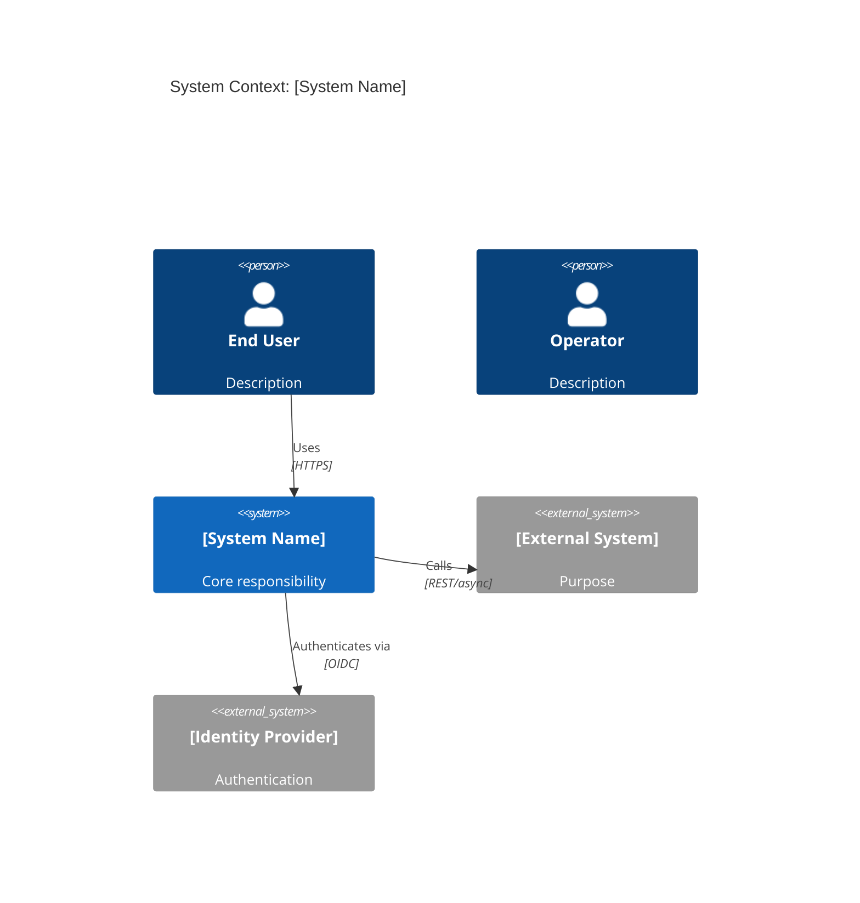
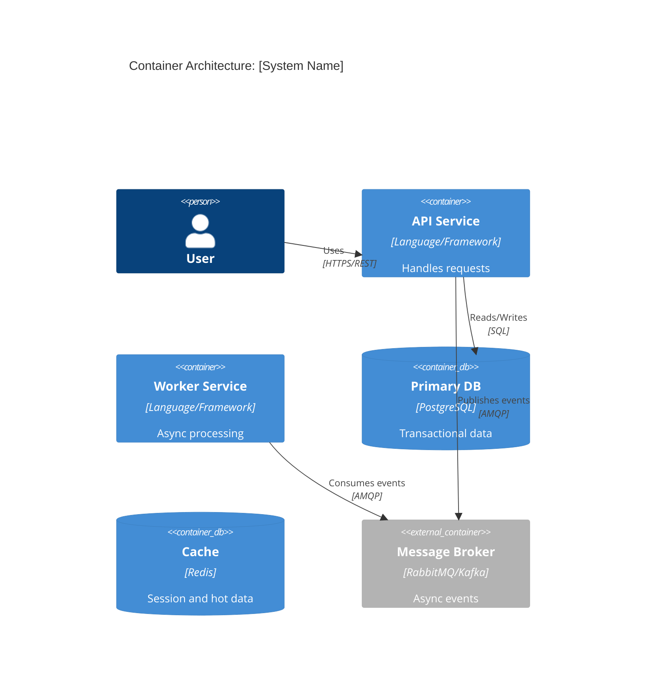
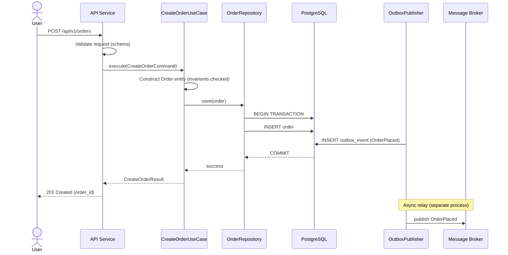

# Tech Architecture Workflow

Design the technical architecture from the canonical data model and product spec outward. Clean architecture. Established patterns only. No exotic choices.

## Step 0: Workspace Resolution
Run this bash to determine workspace paths:
```bash
BRANCH=$(git branch --show-current 2>/dev/null || echo "default")
BRANCH=$(echo "$BRANCH" | tr '[:upper:]' '[:lower:]' | sed 's|/|--|g' | sed 's|[^a-z0-9-]|-|g' | sed 's|-\+|-|g' | sed 's|^-||;s|-$||')
[ -z "$BRANCH" ] && BRANCH="default"
WORKSPACE=".claude/ai-sdlc/workflows/$BRANCH"
STATE="$WORKSPACE/state.json"
ARTIFACTS="$WORKSPACE/artifacts"
mkdir -p "$WORKSPACE/artifacts"
```
Then use $WORKSPACE, $STATE, $ARTIFACTS throughout.

## Step 1: Pre-Flight Gate Check

Read in parallel (ALL required):
- `$ARTIFACTS/data-model/data-model.md` — REQUIRED. Cannot design without data model.
- `$ARTIFACTS/idea/prd.md` — REQUIRED. Cannot design without requirements (especially NFRs).
- `$ARTIFACTS/research/synthesis.md` — technology direction (if exists)
- `$ARTIFACTS/journey/customer-journey.md` — personas and interaction patterns (if exists)
- `$ARTIFACTS/design/tech-architecture.md` — existing architecture (update, never replace)
- `$ARTIFACTS/design/api-spec.md` — existing API spec (if any)
- `$STATE` — constraints (tech stack, team, compliance, environment — read and parse JSON)

If data-model.md missing: STOP. Require data model first.
If prd.md missing: STOP. Require product spec first.

If existing tech-architecture.md: read it fully before proposing changes. Update, don't replace. New changes require ADRs explaining the delta.

---

## Step 2: Extract NFRs and Constraints

Before drawing a single diagram, extract and document all constraints that will drive design decisions:

**From PRODUCT_SPEC.md NFR section:**
```
Performance:    [target latency p50/p95/p99] [throughput rps]
Availability:   [uptime target e.g. 99.9%] → [max downtime/month]
Scalability:    [expected load today] [peak multiplier] [growth projection]
Data volume:    [records/day] [retention period] [storage estimate]
Compliance:     [GDPR / PCI-DSS / HIPAA / SOC2 / ISO 27001 / other]
Security:       [authentication requirements] [data classification]
Recovery:       [RTO] [RPO] — how fast must it recover, how much data loss is acceptable
```

For each NFR, note the specific architectural implication:
- 99.9% availability → requires redundancy, health checks, graceful degradation design
- p95 < 200ms → caching strategy, DB index design, async offloading of slow operations
- PCI-DSS → no card data in logs, tokenisation required, network segmentation
- GDPR → PII data map, right-to-erasure design, data residency constraints
- RPO = 0 → synchronous replication, no data loss architecture

These constraints are non-negotiable inputs to every subsequent step.

---

## Step 3: Service Boundary Decisions

The most consequential decision in the architecture. Make it explicitly, with justification.

**Step 3a: Identify Bounded Contexts**

From DATA_MODEL.md bounded contexts, list each candidate context:
```
Context: [Name]
Entities: [list]
Team ownership: [who owns this]
Change frequency: [high / medium / low]
Scaling requirement: [independent scaling needed?]
Data isolation: [own DB needed?]
```

**Step 3b: Deployment topology decision**

Choose ONE of:
1. **Modular Monolith** — multiple bounded contexts, single deployable, shared DB with schema separation
   - Choose when: small team (< 10 engineers), early product, complex domain not yet stable, high transaction consistency requirements across contexts
2. **Microservices** — each bounded context is a separate deployable with its own data store
   - Choose when: independent scaling requirements differ significantly, independent deployment cadence, separate teams per domain, well-understood domain boundaries
3. **Hybrid (Monolith Core + Extracted Services)** — monolith for core domain, separate services only where justified
   - Choose when: starting with a monolith and extracting proven hotspots

Document the decision as ADR-001 (see Step 9).

**Step 3c: Per-boundary communication style**

For each pair of bounded contexts that must communicate, choose:
```
[Context A] → [Context B]
Style: [sync REST / async event / gRPC / shared library]
Rationale: [why this style]
Consistency model: [strong / eventual]
```

Rules:
- Sync (REST/gRPC): use when caller needs an immediate response to proceed
- Async (events): use when eventual consistency is acceptable, or for notifications/side-effects
- Never share a database across service boundaries — use APIs or events

---

## Step 4: System Context (C4 Level 1)

Define what the system is and who interacts with it:

**System actors:**
- External users (reference personas from CUSTOMER_JOURNEY.md)
- External systems and integration touch points
- Operators / admin users

**Context diagram (Mermaid):**


---

## Step 5: Container Architecture (C4 Level 2)

Define the deployable units.

For each container (service/application):
- Name and single responsibility
- Technology choice with justification (see Step 3b decision)
- Communication protocol
- Data store owned (each service owns its data — no shared databases)
- Scaling approach
- Health check endpoint

**Clean Architecture layers (required in every container):**
```
┌─────────────────────────────────────────────┐
│  Delivery Layer (API/UI/CLI/Events)          │  ← Thin, framework-specific
├─────────────────────────────────────────────┤
│  Application Layer (Use Cases)              │  ← Orchestrates domain
├─────────────────────────────────────────────┤
│  Domain Layer (Entities, Services, Events)  │  ← Pure business logic, no deps
├─────────────────────────────────────────────┤
│  Infrastructure Layer (DB, HTTP, Queue)     │  ← Implements ports
└─────────────────────────────────────────────┘
         DEPENDENCY RULE: always inward ↑
```

**Port and Adapter pattern for all external integrations:**
- Define port interface in Application/Domain layer
- Implement adapter in Infrastructure layer
- Inject at composition root (never `new` in domain/application)

**Container diagram (Mermaid):**


---

## Step 6: Component Design (C4 Level 3)

For each container, design internal components:

**Domain layer components:**
- Entities (from DATA_MODEL.md — one-to-one mapping)
- Value Objects (from DATA_MODEL.md value types)
- Domain Services (business logic spanning multiple entities)
- Domain Events (named in past tense: OrderPlaced, PaymentFailed)
- Repository Interfaces (ports — defined here, implemented in infra)
- Aggregate roots with invariant enforcement

**Application layer components:**
- Use Case / Command Handlers (one class per use case)
- Query Handlers (CQRS if read/write models diverge)
- Port interfaces for external services (email, payment, storage, notifications)
- DTOs / Request-Response objects
- Transaction boundary management

**Infrastructure layer components:**
- Repository implementations (DB adapters)
- External service adapters (payment gateway, email, storage, etc.)
- Cache adapters
- Message queue publishers/consumers
- Database migrations

**Delivery layer components:**
- HTTP controllers (thin — validate input, call use case, serialize output)
- Request validators (schema + type validation only — no business rules)
- Response serializers
- Authentication middleware
- Rate limiting middleware
- Error handling middleware (translates domain/app exceptions → HTTP codes)

---

## Step 7: Security Architecture

Security is designed here, not bolted on later. Work through each section:

**7a: Identity and Authentication**

Choose authentication strategy:
- **JWT + OIDC** (e.g., Auth0, Cognito, Keycloak): use for external user-facing APIs
- **API Keys**: use for machine-to-machine integrations (server-to-server)
- **mTLS**: use for internal service-to-service communication in zero-trust environments
- **Session cookies**: use for browser-based apps where refresh token rotation is managed

Document:
- Token format and claims (what's in the JWT payload)
- Token lifetime and refresh strategy
- Token validation location (API gateway vs per-service)

**7b: Authorization**

Choose model:
- **RBAC** (Role-Based): use when permissions map cleanly to roles (admin, editor, viewer)
- **ABAC** (Attribute-Based): use when permissions depend on resource attributes (owner, org membership, status)
- **ReBAC** (Relationship-Based): use when permissions depend on graph relationships (Google Zanzibar model)

Document:
- Role/permission definitions
- Where authorization is enforced (middleware layer, use case layer, or domain layer)
- Multi-tenancy isolation approach (if applicable)

**7c: Data Security**

For each entity in DATA_MODEL.md that contains sensitive data:
```
Entity/Field: [name]
Classification: [PII / PHI / PCI / Confidential / Internal / Public]
At Rest: [encrypted / hashed / tokenised / plaintext — with justification]
In Transit: [TLS 1.2+ / TLS 1.3 / mTLS]
Access: [who can read/write this field]
Retention: [how long kept, deletion trigger]
Masking: [how it appears in logs/responses to non-privileged callers]
```

**7d: Secret Management**

- Development: `.env` files (never committed)
- Production: [cloud secrets manager / HashiCorp Vault / Kubernetes Secrets with encryption-at-rest]
- Rotation: document secret rotation strategy
- Rule: no secrets in code, config files, or logs — ever

**7e: API Security Hardening**

For every API endpoint, verify:
- [ ] Authentication required (or explicitly marked public with justification)
- [ ] Authorization checked (caller has permission for this resource)
- [ ] Input validated before processing (reject malformed payloads at delivery layer)
- [ ] Rate limiting applied (especially for auth endpoints: stricter limits)
- [ ] Sensitive data not leaked in error messages
- [ ] CORS configured (explicit allowlist, not wildcard `*` for credentialed requests)
- [ ] Security headers: `Strict-Transport-Security`, `X-Content-Type-Options`, `X-Frame-Options`

OWASP API Top 10 checklist (document mitigation per applicable item):
- API1: Broken Object Level Authorization → per-object ownership check in use cases
- API2: Broken Authentication → token validation, short expiry, rotation
- API3: Broken Object Property Level Authorization → never auto-serialize full entity
- API4: Unrestricted Resource Consumption → rate limits, payload size limits, pagination
- API5: Broken Function Level Authorization → explicit authz per endpoint
- API6: Unrestricted Access to Sensitive Business Flows → rate limit sensitive operations
- API7: SSRF → validate all outbound URLs, allowlist external destinations
- API8: Security Misconfiguration → disable debug endpoints in prod, review headers
- API9: Improper Inventory Management → document all endpoints, deprecate properly
- API10: Unsafe Consumption of APIs → validate and sanitize all third-party responses

---

## Step 8: Event-Driven Architecture Design (if applicable)

If the system uses messaging, events, or async communication — design it explicitly.

Skip this step if the system is purely synchronous.

**8a: Event taxonomy**

For each domain event:
```
Event: [Name — past tense, e.g. OrderPlaced]
Producer: [service/context]
Consumers: [service(s)]
Trigger: [what business action causes this]
Payload: [fields — reference DATA_MODEL.md types]
Ordering required: [yes/no — if yes, partition key strategy]
Idempotency: [how consumers handle duplicate delivery]
Retention: [how long kept on the broker]
```

**8b: Message broker topology**

- Topic/queue per event type vs per consumer vs per domain context — choose and justify
- Partitioning strategy (if Kafka): what is the partition key?
- Consumer group design: which consumers share a group (competing consumers) vs have independent groups (pub/sub fan-out)
- Dead letter queue: define retry policy (max attempts, backoff), then DLQ, then alerting

**8c: Reliability contracts**

- Delivery guarantee: at-most-once / at-least-once / effectively-once
- Outbox pattern: use when event must be published atomically with a DB transaction
- Idempotency keys: consumers must be idempotent — document how each consumer achieves this
- Ordering guarantees: document any ordering assumptions and how they're preserved

**8d: Event schema versioning**

- Additive changes (new optional fields): backward compatible, no version bump
- Breaking changes (remove/rename/change type): new event version `OrderPlaced.v2`
- Consumer compatibility: consumers must tolerate unknown fields (tolerant reader pattern)

---

## Step 9: Critical Path Sequence Diagrams

For every significant user-facing flow and every async/distributed flow, draw a sequence diagram.

Minimum required:
- Core happy path for each primary use case
- Any flow spanning more than one service
- Any async flow (event publishing + consumption)
- Any external service call (payment, email, auth)
- Error/failure paths for critical operations



---

## Step 10: Deployment & Infrastructure Architecture

**10a: Runtime environment**

Document the target deployment topology:
- **Container orchestration**: Kubernetes (describe cluster structure) / ECS / Nomad
- **Serverless**: Lambda/Cloud Functions (document cold start implications for latency NFRs)
- **PaaS**: Heroku/Railway/Render (simpler but less control)
- **Bare metal / VMs**: document configuration management approach

**10b: Environment topology**

```
Environments: [local dev] → [dev/CI] → [staging] → [production]
Promotion: [how code moves between environments]
Config management: [how env-specific config is managed — never in code]
Feature flags: [if applicable — what system]
```

**10c: Scaling strategy**

Per container:
```
Service: [name]
Scaling trigger: [CPU % / request rate / queue depth]
Min replicas: [N]
Max replicas: [N]
Stateless: [yes/no — if no, explain session affinity or state externalisation]
```

**10d: Resilience design**

Map each external dependency to its failure handling:
```
Dependency: [name]
Failure mode: [what happens when it's unavailable]
Pattern applied: [Circuit Breaker / Retry+Backoff / Bulkhead / Graceful Degradation]
Timeout: [hard timeout value]
Fallback: [what the system does when the dependency is down]
```

**10e: Health and readiness**

Every service must expose:
- `GET /health/live` → liveness probe (is the process alive?)
- `GET /health/ready` → readiness probe (is it ready to serve traffic? DB connection up, dependencies reachable)
- `GET /health/startup` → startup probe (optional, for slow-starting services)

These are documented here and referenced in the observability phase.

---

## Step 11: Pattern Selection

For each significant design decision, choose a pattern with justification:

```
PATTERN                 | USE WHEN
Repository              | Always — for data access abstraction
CQRS                    | Read/write models diverge significantly
Saga (choreography)     | Distributed transactions, loose coupling preferred
Saga (orchestration)    | Distributed transactions, explicit control flow needed
Event Sourcing          | Audit trail critical, temporal queries needed
Outbox Pattern          | At-least-once event publishing with DB transactions
Circuit Breaker         | External service calls that can fail transiently
Retry + Backoff         | Transient failures (network, throttling)
Bulkhead                | Isolate failures between resource pools
API Gateway             | Multiple clients, cross-cutting concerns (auth, rate limiting)
BFF (Backend for Frontend) | Mobile/web clients have very different needs
Strangler Fig           | Migrating from legacy to new architecture incrementally
```

Rules:
- Only use a pattern if it solves a real problem you have TODAY
- Document the problem it solves as an ADR
- Run simplicity check: could this be solved with less complexity?

---

## Step 12: Technology Evaluation

For each significant technology choice, evaluate using this framework:

```
Technology: [name]
Purpose: [what problem it solves]
Alternatives considered: [list]

Evaluation:
  Fit for purpose:     [HIGH/MED/LOW] — does it solve the actual problem?
  Operational maturity:[HIGH/MED/LOW] — battle-tested, good tooling, known failure modes?
  Team familiarity:    [HIGH/MED/LOW] — ramp-up cost?
  Vendor lock-in risk: [HIGH/MED/LOW] — how hard to swap later?
  Licence/cost:        [acceptable / concern — note details]

Decision: [CHOSEN / REJECTED]
Reason: [one sentence]
```

For every non-trivial technology: prefer boring over novel, well-understood over cutting-edge. The goal is reliable software, not interesting technology.

---

## Step 13: API Design

Design API contracts from the data model (not from convenience):

**REST principles:**
- Resources map to domain aggregates/entities
- HTTP verbs: GET (read), POST (create), PUT (replace), PATCH (partial update), DELETE
- Versioning: URI versioning `/api/v1/` for initial, `/api/v2/` for breaking changes
- Status codes: 200 (ok), 201 (created), 204 (no content), 400 (bad request), 401 (unauth), 403 (forbidden), 404 (not found), 409 (conflict), 422 (validation), 429 (rate limited), 500 (server error)
- Pagination: cursor-based for large collections
- Filtering: query parameters, documented and validated
- Idempotency: mutations should support `Idempotency-Key` header for safe retries
- Error responses: `{ "code": "VALIDATION_ERROR", "message": "...", "fields": [...], "trace_id": "..." }`

**For each endpoint document:**
- Path and HTTP method
- Authentication requirements (or explicitly: public)
- Authorization rules (which roles/permissions)
- Request headers required
- Request body schema (reference DATA_MODEL.md types)
- Response schema (all possible status codes)
- Rate limiting rules
- Idempotency behaviour

**GraphQL (if applicable):**
- Schema design from domain model (not database shape)
- Query complexity limits to prevent expensive queries
- Depth limiting
- Persisted queries for production clients

Write full OpenAPI 3.x YAML in `$ARTIFACTS/design/api-spec.md`.

---

## Step 14: Architecture Decision Records

For each significant decision, write an ADR in `$ARTIFACTS/design/solution-design.md`.

Required ADRs (minimum):
- ADR-001: Deployment topology (monolith vs microservices)
- ADR-002: Authentication strategy
- ADR-003: Database choice(s)
- ADR-004: Message broker (if async architecture)
- ADR-005+: Any non-obvious pattern or technology choice

```markdown
## ADR-001: [Decision Title]
*Date: [date] | Status: Accepted*

### Context
[What situation led to this decision — include NFRs or constraints that apply]

### Decision
[What was decided, stated clearly]

### Rationale
[Why this option over alternatives — address the specific constraints]

### Alternatives Considered
- [Alternative 1]: rejected because [reason]
- [Alternative 2]: rejected because [reason]

### Consequences
- Positive: [benefit]
- Negative: [trade-off accepted]
- Neutral: [implication to be aware of]

### Review trigger
[Under what conditions should this decision be revisited — e.g., "if load exceeds 10k rps"]
```

---

## Step 15: Migration Strategy (brownfield only)

Skip if this is a greenfield project.

If an existing system is being evolved or replaced:

**Migration approach options:**
- **Strangler Fig**: new system gradually takes over routes/features from the old one — safest
- **Branch by Abstraction**: introduce abstraction over legacy code, swap implementation incrementally
- **Parallel Run**: run old and new in parallel, compare outputs, cut over when confident
- **Big Bang**: replace everything at once — only valid for small, non-critical systems

Document:
```
Current state: [what exists today]
Target state: [where we're going]
Approach: [which migration strategy and why]
Phases: [ordered steps to get from current to target]
Rollback: [how to roll back if migration fails at each phase]
Data migration: [how existing data is migrated — scripts, dual-write, backfill]
Cutover plan: [how traffic is shifted — feature flag / DNS / load balancer weight]
```

---

## Step 16: Write Output Documents

**Update $ARTIFACTS/design/tech-architecture.md:**
```markdown
# Technical Architecture
*Last Updated: [date]*

## System Context (C4 L1)
[Mermaid diagram + description]

## Service Boundary Decisions
[Topology choice + per-boundary communication styles]

## Container Architecture (C4 L2)
[Mermaid diagram + container descriptions with tech choices]

## Clean Architecture Layers
[Layer diagram + responsibility descriptions per container]

## Component Design (C4 L3)
[Per-container component list]

## Security Architecture
[Auth, authz, data classification, secret management, OWASP mitigations]

## Event-Driven Architecture
[Event taxonomy, broker topology, reliability contracts — if applicable]

## Critical Path Sequence Diagrams
[One per significant flow]

## Deployment & Infrastructure
[Runtime environment, environment topology, scaling, resilience, health endpoints]

## Patterns Applied
[Pattern → problem it solves → where applied]

## Technology Decisions
[Stack choices via evaluation framework]

## Frontend Architecture
[Only present when project includes a front-end — see Step 16b]

## NFR Coverage
[Each NFR → architectural decision that meets it]

## Migration Strategy
[Brownfield only]
```

**Step 16b: Frontend Architecture section (include only if project has a front-end)**

When the project includes a front-end component, add a `## Frontend Architecture` section to TECH_ARCHITECTURE.md:

```markdown
## Frontend Architecture

| Dimension | Decision | Rationale |
|-----------|---------|-----------|
| Platform targets | iOS / Android / Web | [why cross-platform] |
| Framework | Expo SDK [version] + React Native | [rationale] |
| Navigation | Expo Router v3 | File-based, works cross-platform |
| Component base | Tamagui [version] | Design tokens first-class, cross-platform performance |
| Server state | TanStack Query v5 | [rationale] |
| Client state | Zustand | UI state only |
| Build / OTA | EAS Build + EAS Update | [rationale] |
| Design system level | [None / Brand / Full] | [what exists] |
| Testing (unit) | Jest + RNTL | |
| Testing (E2E) | Maestro | Cross-platform, simpler than Detox |
```

After Phase 6 verify passes, if a Frontend Architecture section is present: output this note:

> **Frontend stack detected.** Ask Claude to run the fe-setup workflow before Phase 7 to configure design tokens and derive SCREEN_SPEC.md from the customer journey. Phase 7 planning requires SCREEN_SPEC.md to generate FE tasks.


**Update $ARTIFACTS/design/api-spec.md:**
Full OpenAPI 3.x specification.

**Update $ARTIFACTS/design/solution-design.md:**
All ADRs (minimum 5 required: topology, auth, DB, messaging if async, key pattern choices).

---

## Step 17: Simplicity Check

Before finalizing, challenge every design decision:
- Is this the simplest design that meets ALL the NFRs?
- Is each pattern actually needed or just familiar?
- Can any services, layers, or components be merged without losing clarity?
- Is the data flow understandable to a new engineer?
- Are there any abstractions that don't justify their complexity?
- Would a modular monolith serve the current scale better than microservices?

If any answer suggests over-engineering: simplify, update the ADR, document the reasoning.

---

## Step 17b: Architecture Challenger Review

Before moving to planning and building, take two explicit positions against the architecture just designed. This is not a self-check — it is a structured adversarial review designed to surface problems that confirmation bias would miss.

Re-read `tech-architecture.md`, `solution-design.md`, and `api-spec.md` in full.

---

### Position A — Architect's defence (one sentence per decision)

Briefly state the strongest justification for each major decision:
- Deployment topology choice (monolith/microservices/hybrid)
- Primary database choice
- Authentication strategy
- Any non-obvious pattern (CQRS, Saga, Event Sourcing, etc.)

This is not for the user — it is to force an explicit articulation of why before the attack begins.

---

### Position B — Challenger's attack

For each attack below, adopt an adversarial stance. The goal is to find real problems, not to validate. Be specific — name the component, the NFR, the endpoint, or the ADR being challenged.

**Attack 1 — Over-engineering**
Name every service, pattern, or abstraction that exists for a requirement that isn't in `prd.md`. Common offenders: event sourcing added "for auditability" when a simple updated_at field would do; CQRS added when there is no read/write model divergence; microservices when a single team owns everything.
For each: what is the cost (operational complexity, latency, debugging difficulty) vs the concrete requirement it satisfies?

**Attack 2 — NFR gaps**
For each NFR in `prd.md` with a numeric threshold (p95 latency, uptime %, throughput rps), identify the specific architectural mechanism that delivers it:
- p95 < 200ms: which component is the bottleneck? Does the design have caching, indexing, or async offloading for that path?
- 99.9% availability: where does the design have a single point of failure with no fallback? Is the SPOF acceptable given the SLO?
- If any NFR has no corresponding design mechanism: it is a gap, not a goal.

**Attack 3 — Security surface not covered by threat model**
Walk every external entry point (API endpoints, event consumers, admin interfaces, webhooks) and ask: is there a threat model entry for this? Common gaps:
- Internal service-to-service calls with no mTLS or API key
- Webhook endpoints that accept payloads without signature verification
- Admin endpoints with no rate limiting or IP allowlisting
- Events consumed from an external broker with no schema validation

**Attack 4 — Data model / API mismatch**
For every resource in `api-spec.md`, trace it back to `data-model.md`. If the API shape requires joining multiple aggregates, or if a field in the API response has no clear source in the data model, flag it — these are design mismatches that will produce ugly infrastructure code.

**Attack 5 — Operational survivability**
For the three most likely failure scenarios (primary DB down, external payment service down, message broker down), trace exactly what happens to in-flight requests. Does the design have circuit breakers, fallbacks, and graceful degradation for each? If a failure requires manual intervention to recover, is there a runbook path?

**Attack 6 — Irreversible decisions**
List every decision that would require a full rewrite or data migration to undo. Rank them by: (a) how likely they are to be wrong, and (b) how expensive they would be to reverse. The highest-risk irreversible decisions deserve the most scrutiny before they are locked in.

---

### Present the debate to the user

```
Architecture Challenger Review
════════════════════════════════════════
Architect's position: [N major decisions defended]

Challenger findings:

[BLOCKING | WARN | NOTE]  [attack area] — [specific component or decision]
  Architect: [one sentence defence]
  Challenger: [one sentence attack]
  Risk if wrong: [what breaks]
  Options:
    a) [address now — specific change]
    b) [accept the risk — state the assumption explicitly in an ADR]

[If no significant issues:]
✅  No blocking issues found. The architecture is well-matched to the stated requirements.
    Noted future pressure points: [list if any, or "none"]

→ Do you want to adjust anything before planning and building?
  (Type your changes, address specific items by letter, or "proceed")
```

**If the user adjusts:** make the changes, update the relevant ADRs, apply stale cascade to any downstream phases that are affected, then re-run this step.

**If the user proceeds:** record `phases.design.challengerReviewComplete = true` in `$STATE` and continue to Step 18.

---

## Step 18: Update State

Mark Phase 6 (Tech Architecture) complete in $STATE.

Output:
```
✅ Tech Architecture Complete

Deployment topology: [monolith / microservices / hybrid]
Containers/Services: [N]
Domain Entities: [N]
API Endpoints: [N]
ADRs Documented: [N]
Security: Auth=[strategy] | AuthZ=[model] | Secrets=[approach]
Event-driven: [yes — N event types / no]

Files Updated:
• $ARTIFACTS/design/tech-architecture.md
• $ARTIFACTS/design/api-spec.md
• $ARTIFACTS/design/solution-design.md

Recommended Next: /sdlc:00-start (verify is automatic, or say "verify phase N") 6   ← run this before proceeding
Then:           the plan phase (tell Claude to proceed)
```
