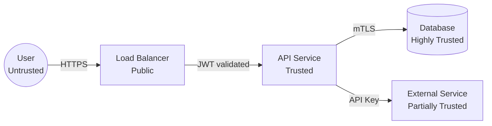
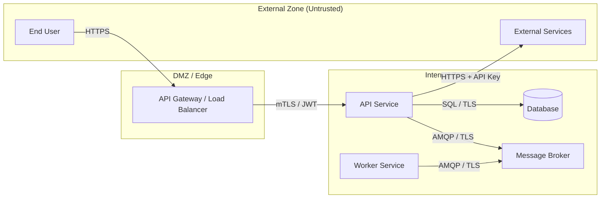

# Threat Model Workflow

STRIDE threat modeling against the current technical architecture. Identifies threats per component, rates severity by likelihood and impact, maps mitigations to test cases, and checks OWASP API Top 10.

---

## Step 0: Workspace Resolution

@~/.claude/sdlc/workflows/workspace-resolution.md

After resolution, set the phase artifact directory:
```bash
PHASE_ARTIFACTS="$ARTIFACTS/threat-model"
mkdir -p "$PHASE_ARTIFACTS"
```

---

## Step 1: Trigger & Scope

Read `$ARTIFACTS/design/tech-architecture.md` and check whether threat modeling is needed:

**Required** if the system handles ANY of:
- Authentication or authorization (JWT, OAuth, API keys, sessions, RBAC/ABAC)
- PII fields (names, emails, addresses, phone numbers, government IDs)
- Payment or financial data (card numbers, bank accounts, transaction amounts)
- External integrations (third-party APIs, webhooks, file uploads, inbound data)

**Optional** otherwise (e.g., internal tooling with no external users, no sensitive data).

If threat modeling is not required AND `--auto-chain` is set:
- Log to state.json autoChainLog: `{ "skill": "threat-model", "triggeredAfter": "design", "status": "skipped-condition-not-met", "artifact": null, "summary": "Threat modeling not required for this scope.", "completedAt": "<ISO-timestamp>" }`
- Output: `Threat modeling not required for this scope.`
- Stop.

If running interactively and the condition is not met: ask whether to proceed anyway.

---

## Step 2: Asset Identification

Read in parallel:
- `$ARTIFACTS/design/tech-architecture.md` — components, trust boundaries, auth strategy
- `$ARTIFACTS/design/api-spec.md` — endpoints, authentication requirements (if exists)
- `$ARTIFACTS/data-model/data-model.md` — entities, PII fields, data classifications (if exists)
- `$ARTIFACTS/design/solution-design.md` — ADRs, security decisions (if exists)

List all assets worth protecting. At minimum, evaluate:

| Asset Category | Examples | Present in This System |
|----------------|----------|----------------------|
| User credentials / session tokens | Passwords, JWTs, refresh tokens, API keys | [yes/no — specifics] |
| PII fields | Email, name, address, phone, DOB, government ID | [yes/no — fields from data-model.md] |
| Payment / financial data | Card numbers, bank accounts, transaction amounts | [yes/no] |
| Business confidential data | Pricing rules, unreleased features, customer lists | [yes/no] |
| Infrastructure access | DB credentials, cloud access keys, internal API keys | [yes/no] |
| Service availability | Uptime, response time, processing throughput | [yes/no] |

Build a component inventory:
```
Component: [name]
Type: [API / Worker / Database / Message Broker / External Service / Auth Provider]
Handles PII: [yes/no — fields listed]
Auth required: [yes/no — method]
External-facing: [yes/no]
```

---

## Step 3: Trust Boundary Mapping

From the architecture, identify trust boundaries — points where data crosses between zones of different trust levels:

- External user → API gateway / load balancer
- API service → database
- API service → external third-party service
- Service → message broker
- Internal service A → internal service B
- Admin/ops tooling → production systems

Draw a Mermaid flowchart for the trust boundary diagram:





Adapt to the actual architecture — add, remove, or relabel nodes as needed.

---

## Step 4: STRIDE Analysis

For each trust boundary and each significant data flow, work through all six STRIDE categories. Think like an attacker — what could go wrong?

```
SPOOFING
  Q: Can an attacker impersonate a legitimate user or service?
  Check: Auth tokens, session management, service identity
  Examples: JWT forgery, stolen tokens, DNS spoofing, credential reuse after logout

TAMPERING
  Q: Can an attacker modify data in transit or at rest?
  Check: Input validation, HTTPS enforcement, DB integrity, request signing, audit log protection
  Examples: SQL injection, MITM attack, parameter tampering, unsigned messages on queue

REPUDIATION
  Q: Can a user or attacker deny performing an action?
  Check: Audit logs, transaction IDs, digital signatures, log integrity
  Examples: "I never placed that order", no audit trail, logs are deletable

INFORMATION DISCLOSURE
  Q: Can sensitive data be exposed to unauthorized parties?
  Check: Error messages, logs, API responses, caching headers, misconfigured storage
  Examples: PII in logs, stack traces in API errors, misconfigured S3 bucket, verbose errors

DENIAL OF SERVICE
  Q: Can the system be made unavailable or unusably slow?
  Check: Rate limiting, input size limits, resource exhaustion, regex complexity
  Examples: No rate limiting on login, gigantic file uploads, long regex ReDoS, unauthenticated DB queries

ELEVATION OF PRIVILEGE
  Q: Can a user gain capabilities they should not have?
  Check: Authorization checks at use-case layer (not just gateway), input-based role assignment
  Examples: IDOR (Insecure Direct Object Reference), missing authz check, user setting their own role, JWT claim tampering
```

For each threat found, produce a threat record:

```
Threat ID: T-001
Category: [S / T / R / I / D / E]
Description: [specific threat description — not generic, tied to this system]
Asset at risk: [which asset from Step 2]
Entry point: [where the attack enters — e.g., POST /api/v1/auth/login, file upload endpoint]
Likelihood: HIGH | MEDIUM | LOW
Impact: CRITICAL | HIGH | MEDIUM | LOW
Risk level: [derived from Likelihood × Impact matrix below]
Mitigation: [specific technical control — e.g., "validate JWT signature and expiry on every request in auth middleware"]
Implementation: [where in the codebase — delivery layer / auth middleware / use case / infrastructure adapter]
Verification: [how to test this mitigation is working — TC-ID from test-cases.md or specific test description]
Status: MITIGATED | ACCEPTED | TRANSFERRED | AVOIDED
```

Risk level matrix:
```
                LOW impact    HIGH impact    CRITICAL impact
HIGH likelihood   MEDIUM         HIGH          CRITICAL
MED likelihood    LOW            MEDIUM        HIGH
LOW likelihood    LOW            LOW           MEDIUM
```

---

## Step 5: Risk Priority Matrix

After recording all threats, plot them in the risk matrix:

```
                  LOW impact    HIGH impact    CRITICAL impact
HIGH likelihood   [T-00x]       [T-00x]        [T-00x — fix first]
MED likelihood    ...           ...            ...
LOW likelihood    ...           ...            ...
```

Risk treatment decisions:
- **CRITICAL risk** (high likelihood + critical impact): Must mitigate before launch — no exceptions
- **HIGH risk**: Must mitigate before production deployment
- **MEDIUM risk**: Mitigate in the next sprint
- **LOW risk**: Accept with monitoring — log and review quarterly

---

## Step 6: OWASP API Top 10 Checklist

For API-based systems, walk through each item and mark MITIGATED, PARTIAL, or OPEN:

```
API1: Broken Object Level Authorization
  Risk: User A can access User B's data by changing the ID in the URL (IDOR)
  Mitigation: Check resource ownership in every use case, not just authentication
  Status: [MITIGATED / PARTIAL / OPEN]
  Control: [specific control in this system]

API2: Broken Authentication
  Risk: Weak tokens, no expiry, tokens not invalidated on logout
  Mitigation: JWT with short expiry + refresh rotation, logout invalidates tokens in denylist
  Status: [MITIGATED / PARTIAL / OPEN]
  Control: [specific control]

API3: Broken Object Property Level Authorization
  Risk: User can modify properties they should not (e.g., set their own role to admin)
  Mitigation: Input allowlisting — only accept fields the caller is permitted to change
  Status: [MITIGATED / PARTIAL / OPEN]
  Control: [specific control]

API4: Unrestricted Resource Consumption
  Risk: No limits on request size, rate, or resource usage — enables DoS
  Mitigation: Rate limiting per user/IP, payload size limits, pagination required on list endpoints
  Status: [MITIGATED / PARTIAL / OPEN]
  Control: [specific control]

API5: Broken Function Level Authorization
  Risk: Admin endpoints accessible to non-admin users
  Mitigation: Explicit permission check per endpoint, not just authentication middleware
  Status: [MITIGATED / PARTIAL / OPEN]
  Control: [specific control]

API6: Unrestricted Access to Sensitive Business Flows
  Risk: Bulk scraping, credential stuffing, mass account creation
  Mitigation: Aggressive rate limiting on login, signup, password reset — stricter than general endpoints
  Status: [MITIGATED / PARTIAL / OPEN]
  Control: [specific control]

API7: Server-Side Request Forgery (SSRF)
  Risk: Attacker causes server to make requests to internal services via user-controlled URL
  Mitigation: Validate and allowlist all outbound URLs — never let users specify URLs for server-side fetching
  Status: [MITIGATED / PARTIAL / OPEN]
  Control: [specific control]

API8: Security Misconfiguration
  Risk: Debug endpoints enabled, default credentials, verbose errors in production
  Mitigation: Security headers configured, debug mode off in prod, error messages sanitized
  Status: [MITIGATED / PARTIAL / OPEN]
  Control: [specific control]

API9: Improper Inventory Management
  Risk: Outdated API versions in production, undocumented admin endpoints
  Mitigation: Version all APIs, document all endpoints, deprecate and remove old versions properly
  Status: [MITIGATED / PARTIAL / OPEN]
  Control: [specific control]

API10: Unsafe Consumption of APIs
  Risk: Blindly trusting data from third-party APIs — inheriting their bugs or malicious data
  Mitigation: Validate and sanitize all third-party API responses before processing or storing
  Status: [MITIGATED / PARTIAL / OPEN]
  Control: [specific control]
```

---

## Step 7: Write Output Document

Write `$ARTIFACTS/design/threat-model.md`:

```markdown
# Threat Model
*Generated: [date] | Branch: [branch]*

## Trust Boundaries
[Mermaid flowchart from Step 3]

## Asset Inventory
[Table from Step 2: Asset Category | Present | Details]

## Component Inventory
[Table: Component | Type | PII | Auth Required | External-Facing]

## STRIDE Analysis

### CRITICAL Threats
[All CRITICAL risk threats — full T-NNN entries from Step 4]

### HIGH Threats
[All HIGH risk threats — full T-NNN entries]

### MEDIUM Threats
[Summary table: T-ID | Category | Description | Mitigation | Status]

### LOW Threats
[Summary table: T-ID | Category | Description | Status]

## Risk Priority Matrix
[3×3 likelihood × impact matrix with threat IDs plotted]

## OWASP API Top 10 Coverage
[Table: API# | Description | Status | Control]
[Overall score: N/10 mitigated]

## Threat Coverage by STRIDE Category
[Table: Category | Threats Found | Mitigated | Open]

## Required Mitigations (Priority Ordered)
1. [CRITICAL threats first — specific action + owner layer + TC-ID for verification]
2. ...

## Security Requirements → ADR Mapping
[Table: Mitigation | Required ADR | Status (exists / stub needed / none)]
```

Also write `$PHASE_ARTIFACTS/threat-model.md` (same content — kept in the phase artifact directory for state tracking).

---

## Step 8: Wire to Review Gate

After writing the artifact, output the review gate summary:

```
Threat Model Complete
══════════════════════════════
Components analysed: [N]
Threats identified: [N]
  Critical risk: [N] — must fix before launch
  High risk:     [N] — must fix before production
  Medium risk:   [N] — next sprint
  Low risk:      [N] — accepted with monitoring

OWASP API Top 10: [N/10 mitigated]

Open items requiring new ADRs: [N]

Artifact: $ARTIFACTS/design/threat-model.md

→ Review each CRITICAL and HIGH threat mitigation before proceeding.
→ All mitigations must have test cases (TC-IDs) in test-cases.md.
→ Run /sdlc:09-test-cases after this phase to generate security test cases from threat records.
```

---

## Step 9: Update State

Read `$STATE`, then write back with the autoChainLog entry appended:

```json
{
  "skill": "threat-model",
  "triggeredAfter": "design",
  "status": "completed",
  "artifact": "<ARTIFACTS>/design/threat-model.md",
  "summary": "<N> threats found: <X> CRITICAL, <Y> HIGH, <Z> MEDIUM, <W> LOW. OWASP: <N>/10 mitigated.",
  "completedAt": "<ISO-timestamp>"
}
```

Also update: `phases.threat-model.status = "completed"`
