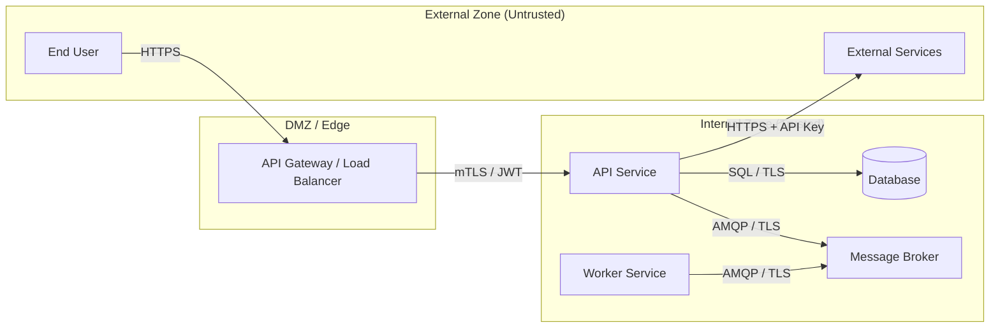

# Threat Model Workflow

STRIDE threat modeling against the current technical architecture. Identifies threats per component, rates severity, and maps mitigations to ADRs.

---

## Step 0: Workspace Resolution

@/Users/seanlew/sdlc/workflows/workspace-resolution.md

After resolution, set the phase artifact directory:
```bash
PHASE_ARTIFACTS="$ARTIFACTS/threat-model"
mkdir -p "$PHASE_ARTIFACTS"
```

---

## Step 1: Condition Check

Read `$ARTIFACTS/design/tech-architecture.md`.

Check for:
- Auth/security section (keywords: authentication, authorization, JWT, OAuth, API key, mTLS, OIDC, RBAC, ABAC)
- External service integrations (keywords: external, third-party, integration, webhook, payment, email, storage, CDN, IdP)

If neither is found AND `--auto-chain` is set:
- Log to state.json autoChainLog: `{ "skill": "threat-model", "triggeredAfter": "design", "status": "skipped-condition-not-met", "artifact": null, "summary": "No auth or external services found in architecture", "completedAt": "<ISO-timestamp>" }`
- Output: `⏭️ threat-model — skipped: no auth/external services in architecture`
- Stop.

If running interactively without the condition being met: ask the user whether to proceed anyway.

---

## Step 2: Read Architecture Artifacts

Read in parallel:
- `$ARTIFACTS/design/tech-architecture.md` — components, trust boundaries, auth strategy
- `$ARTIFACTS/design/api-spec.md` — endpoints, authentication requirements (if exists)
- `$ARTIFACTS/data-model/data-model.md` — entities, PII fields, data classifications (if exists)
- `$ARTIFACTS/design/solution-design.md` — ADRs, security decisions (if exists)

Build a component inventory:
```
Component: [name]
Type: [API / Worker / Database / Message Broker / External Service / Auth Provider]
Handles PII: [yes/no — fields listed]
Auth required: [yes/no — method]
External-facing: [yes/no]
```

---

## Step 3: Identify Trust Boundaries

From the architecture, identify trust boundaries — points where data crosses between zones of different trust levels:

- External user → API gateway / load balancer
- API service → database
- API service → external third-party service
- Service → message broker
- Internal service A → internal service B
- Admin/ops tooling → production systems

Draw a Mermaid flowchart for the trust boundary diagram:



Adapt to the actual architecture — add, remove, or relabel nodes as needed.

---

## Step 4: STRIDE Analysis Per Component

For each component in the inventory, work through all six STRIDE categories. Think like an attacker — what could go wrong?

### Spoofing (S)
Can an attacker impersonate a user, service, or system actor?
- Can credentials be stolen or forged?
- Is the authentication mechanism strong enough?
- Can a legitimate token be reused after logout?
- Can an internal service be impersonated by a compromised peer?

### Tampering (T)
Can data be modified in transit or at rest without detection?
- Are database records protected against direct manipulation?
- Is message integrity verified on the message broker?
- Can API request payloads be altered in transit (is TLS enforced end-to-end)?
- Can audit logs be deleted or modified?

### Repudiation (R)
Can a user or service deny having performed an action?
- Are user actions logged with immutable audit trails?
- Do audit logs capture enough context (who, what, when, from where)?
- Are log records protected from tampering?
- Is there non-repudiation for financial or legal operations?

### Information Disclosure (I)
What sensitive data could be exposed to unauthorised parties?
- Could error responses leak stack traces, SQL, or internal paths?
- Are PII fields encrypted at rest and in transit?
- Could logs contain sensitive field values?
- Is there any path where a lower-privilege user can access higher-privilege data?

### Denial of Service (D)
What could be overwhelmed or made unavailable?
- Are API endpoints rate-limited?
- Could a large payload cause memory exhaustion?
- Could a slow DB query be triggered by unauthenticated users?
- Could the message queue be flooded?

### Elevation of Privilege (E)
Can a user gain access or capabilities beyond their authorization?
- Are authorization checks enforced at the use-case layer (not just the API gateway)?
- Can an IDOR (Insecure Direct Object Reference) expose another user's resources?
- Can JWT claims be tampered with (is the signature validated)?
- Are admin endpoints separately protected?

---

## Step 5: Threat Register

For each threat identified in Step 4, create a structured entry:

```
THREAT-NNN
STRIDE category: [S/T/R/I/D/E]
Component: [affected component]
Description: [what the attack is]
Attack vector: [how an attacker would execute it]
Severity: [CRITICAL / HIGH / MEDIUM / LOW]
  CRITICAL = exploitable without auth, data breach / system compromise
  HIGH = exploitable with minimal privilege, significant impact
  MEDIUM = requires some privilege or specific conditions
  LOW = theoretical, difficult to exploit, minimal impact
Mitigations:
  - [specific countermeasure]
  - [specific countermeasure]
ADR reference: [ADR-NNN if a design decision addresses this, or "None — new ADR needed"]
Status: [Open / Mitigated / Accepted Risk]
```

---

## Step 6: Write Artifact

Write `$PHASE_ARTIFACTS/threat-model.md`:

```markdown
# Threat Model
*Generated: [date] | Branch: [branch]*

## Trust Boundaries
[Mermaid flowchart from Step 3]

## Component Inventory
[Table: Component | Type | PII | Auth Required | External-Facing]

## STRIDE Analysis

### CRITICAL Findings
[All CRITICAL severity threats — full entries from Step 5]

### HIGH Findings
[All HIGH severity threats — full entries]

### MEDIUM Findings
[Summary table: THREAT-ID | Category | Component | Description | Mitigation]

### LOW Findings
[Summary table: THREAT-ID | Category | Component | Description]

## HIGH+ Findings Summary
[Consolidated table of all CRITICAL and HIGH threats:
THREAT-ID | Component | Category | Description | Primary Mitigation | ADR]

## Recommended Mitigations
Priority-ordered list of actions:

1. [CRITICAL threats first — specific action + owner layer]
2. ...

## Security Requirements → ADR Mapping
[Table: Mitigation → Required ADR | Status (exists / stub needed / none)]

## Threat Coverage by STRIDE Category
[Table: Category | Threats Found | Mitigated | Open]
```

---

## Step 7: Update State

Read `$STATE`, then write back with the autoChainLog entry appended:

```json
{
  "skill": "threat-model",
  "triggeredAfter": "design",
  "status": "completed",
  "artifact": "<PHASE_ARTIFACTS>/threat-model.md",
  "summary": "<N> threats found: <X> CRITICAL, <Y> HIGH, <Z> MEDIUM, <W> LOW",
  "completedAt": "<ISO-timestamp>"
}
```

---

## Step 8: Output

If `--auto-chain`:
```
✅ threat-model — <N> threats: <X> CRITICAL <Y> HIGH [<PHASE_ARTIFACTS>/threat-model.md]
```

If interactive:
```
✅ Threat Model Complete

Components analysed: [N]
Threats identified: [total]
  CRITICAL: [N] — [brief description of worst finding]
  HIGH:     [N]
  MEDIUM:   [N]
  LOW:      [N]

Open items requiring ADRs: [N]

Artifact: <PHASE_ARTIFACTS>/threat-model.md

Recommended actions:
1. [Most critical mitigation]
2. [Second most critical]
```
